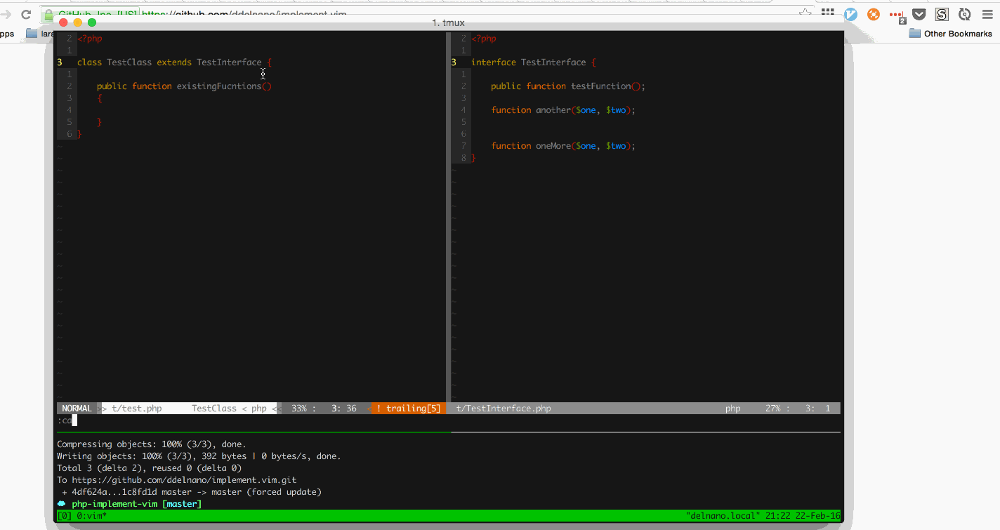

## Implement.vim

Implement.vim is to replicate PHPStorm's auto generate abstract class and interface methods for the current php class.

The plugin is not fully completed yet but will be very shortly!  Check back for updates until the 1.0 release.

## Todo
- [ ] Gif shows a screen shot of extending an interface.....
  - Update plugin to make sure its an interface.
- [ ] Add more comprehensive test to vspec that verifies full plugin behavior
- [ ] Add way to custom map function
- [ ] Rename function that performs main functionality
- [ ] Make it work for abstract classes
